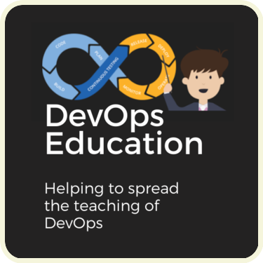

<p align="center"> 
   
</p>

<p align="center">

<a href="https://github.com/devops-education/Teaching-Methods-in-Devops-Education/stargazers" target="blank">

</a>
<a href="https://github.com/devops-education/Teaching-Methods-in-Devops-Education/issues" target="blank">

</a>
<a href="https://github.com/devops-education/Teaching-Methods-in-Devops-Education/pulls" target="blank">

</a>
</p>


It's a repository that contains a set of challenge overcome by teaching methods in DevOps. The objective is to help DevOps educators to teach DevOps. Some of theses teaching methods are found in the paper [Overcomming Challenges in DevOps Education through Teaching Methods](https://arxiv.org/pdf/2302.05564.pdf) published at the academic conference **ICSE'23: Proceedings of the IEEE/ACM International Conference on Software Engineering**. 

### Table of Content 

- [Challenges overcome by Teaching Methods](#challenges-overcome-by-teaching-methods)
  - [Project-based learning](#project-based-learning) 
  - [Collaborative Learning](#collaborative-learning)
  - [Educational support tool](#educational-support-tool)
  - [Example-based learning](#example-based-learning)
  - [Personalized learning](#personalized-learning)
  - [Labs](#labs)
  - [Mentoring](#mentoring)
  - [Seminar](#seminar)
  - [Tutorial](#tutorial)
  - [Discussion](#discussion)
  - [Quiz](#quiz)
  - [Research-based teaching](#research-based-teaching)
- [Contributors and contribute](#contributors-and-contribute)
- [License](#license)

## Challenges overcome by Teaching Methods

To facilitate understanding, the challenges were organized in teaching methods. Each challenge is linked to a discussion. Then, theses are the following teaching methods:

### [Project-based learning](https://github.com/devops-education/Teaching-Methods-in-DevOps-Education/discussions?discussions_q=is%3Aopen+label%3A%22project-based+learning%22)

```
Definition: It focuses on a project in which the students work on a concrete
task. [Indiramma, M.. “Project based learning — Theoretical foundation of
computation course” (2014)] 
```

- [Lack of time for teachers to develop a ready-made and well-crafted example system.](https://github.com/devops-education/Teaching-Methods-in-DevOps-Education/discussions/1)
- [Make a DevOps course attractive to the students is challenging.](https://github.com/devops-education/Teaching-Methods-in-DevOps-Education/discussions/2)
- [The customers had problem desiging the user interface of the project. ](https://github.com/devops-education/Teaching-Methods-in-DevOps-Education/discussions/3)


### [Collaborative learning](https://github.com/devops-education/Teaching-Methods-in-DevOps-Education/discussions?discussions_q=is%3Aopen+label%3A%22collaborative+learning%22)

```
Definition: The students work collaboratively exchanging information and
resolving tasks. The teacher is the active partner not just a repository of the
information such as traditional education. [Pivec et al. “Aspects of Game-Based
Learning.” (2003)]
```
- [It is difficult to teach agile tecnhiques.](https://github.com/devops-education/Teaching-Methods-in-DevOps-Education/discussions/4)
- [Doing a hands-on class with that many (45) students is just phisically challenging.](https://github.com/devops-education/Teaching-Methods-in-DevOps-Education/discussions/5)
- [Difficulty in understanding the importance of setting the environment.](https://github.com/devops-education/Teaching-Methods-in-DevOps-Education/discussions/6)
- [Difficulty in teaching the student how to operate the systems, allowing addiction of new features without breaking the system.](https://github.com/devops-education/Teaching-Methods-in-DevOps-Education/discussions/7)
- [Difficulty in evaluating the understanding of Continuous Delivery.](https://github.com/devops-education/Teaching-Methods-in-DevOps-Education/discussions/8)
- [Difficulties in guaranteeing an efficient communication between everyone in the group](https://github.com/devops-education/Teaching-Methods-in-DevOps-Education/discussions/9)
- [Difficult in each student has all skills](https://github.com/devops-education/Teaching-Methods-in-DevOps-Education/discussions/10)


### [Educational support tool](https://github.com/devops-education/Teaching-Methods-in-DevOps-Education/discussions?discussions_q=is%3Aopen+label%3A%22educational+support+tool%22)

```
Definition: A tool or integrated environment used to support the teaching or
learning. [Qurat-ul-Ain et al. “A Review of Technological Tools in Teaching and
Learning Computer Science.” Education (2019)]
```
- [Difficulty in evaluating the understanding of Continuous Delivery.](https://github.com/devops-education/Teaching-Methods-in-DevOps-Education/discussions/11)
- [Insufficient literature related to teach DevOps.](https://github.com/devops-education/Teaching-Methods-in-DevOps-Education/discussions/12)
- [Difficulty in teaching the student how to operate the systems, allowing addiction of new features without breaking the system.](https://github.com/devops-education/Teaching-Methods-in-DevOps-Education/discussions/13)
- [Difficulty in setting up the environment.](https://github.com/devops-education/Teaching-Methods-in-DevOps-Education/discussions/14)
- [Lack of specific tool for DevOps teaching.](https://github.com/devops-education/Teaching-Methods-in-DevOps-Education/discussions/15)
- [Exercise with professional scenarios.](https://github.com/devops-education/Teaching-Methods-in-DevOps-Education/discussions/16)
- [Difficulty during institution's resources authorization.](https://github.com/devops-education/Teaching-Methods-in-DevOps-Education/discussions/17)
- [Difficulty in understanding environment, tool, and network configuration.](https://github.com/devops-education/Teaching-Methods-in-DevOps-Education/discussions/18)
- [Limited time on teaching DevOps.](https://github.com/devops-education/Teaching-Methods-in-DevOps-Education/discussions/19)
- [There is a large number of DevOps tools.](https://github.com/devops-education/Teaching-Methods-in-DevOps-Education/discussions/20)
- [The process of making students to migrato to other tools is bad.](https://github.com/devops-education/Teaching-Methods-in-DevOps-Education/discussions/21)
- [Difficulty in remote work with students: privacy, availability, infraestructure differences, environment configuration.](https://github.com/devops-education/Teaching-Methods-in-DevOps-Education/discussions/22)
- [The educational support tool takes long time processing](https://github.com/devops-education/Teaching-Methods-in-DevOps-Education/discussions/23)
- [Students require fast feedback.](https://github.com/devops-education/Teaching-Methods-in-DevOps-Education/discussions/24)
- [Students have hard time debugging environment](https://github.com/devops-education/Teaching-Methods-in-DevOps-Education/discussions/25)


### [Example-based learning](https://github.com/devops-education/Teaching-Methods-in-DevOps-Education/discussions?discussions_q=is%3Aopen+label%3A%22example-based+learning%22)

```
Definition: It's based on providing worked examples that illustrate a written
account of how a problem should be or can be solved. [Van Gog et al "Example-Based Learning:
Integrating Cognitive and Social-Cognitive Research Perspectives" (2010)]
```

- [Students desinterest in cultural aspects of DevOps.](https://github.com/devops-education/Teaching-Methods-in-DevOps-Education/discussions/26)
- [Teach DevOps concepts to students no industrial experience is hard.](https://github.com/devops-education/Teaching-Methods-in-DevOps-Education/discussions/27)
- [Difficulty at select of a realistic example system for students.](https://github.com/devops-education/Teaching-Methods-in-DevOps-Education/discussions/28)

### [Personalized learning](https://github.com/devops-education/Teaching-Methods-in-DevOps-Education/discussions?discussions_q=is%3Aopen+label%3A%22personalized+learning%22)

```
Definition: It describes various instructional approaches aimed at meeting the
learning needs of individuals. [Akyuz, Yasar."Effects of intelligent tutoring
systems (ITS) on personalized learning (PL)" (2020)]
```
- [The multidisciplinary of DevOps is hard to deal with.](https://github.com/devops-education/Teaching-Methods-in-DevOps-Education/discussions/29)
- [Students difficulty in remote learning: in monitoring and keeping in contact.](https://github.com/devops-education/Teaching-Methods-in-DevOps-Education/discussions/30)
- [It is challenging to deal with students having different backgrounds.](https://github.com/devops-education/Teaching-Methods-in-DevOps-Education/discussions/31)
- [Teach DevOps concepts to students no industrial experience is hard.](https://github.com/devops-education/Teaching-Methods-in-DevOps-Education/discussions/32)

### [Labs](https://github.com/devops-education/Teaching-Methods-in-DevOps-Education/discussions?discussions_q=is%3Aopen+label%3Alabs)

```
Definition: It involves accomplishing practical tasks exploring a computer
science topic usually conducted in dedicated rooms equipped with computers for
each student. [Hazzan et al. "Lab-based teaching" (2020)]
```

- [Students may be not familiar with how to interact with version control tools from command line.](https://github.com/devops-education/Teaching-Methods-in-DevOps-Education/discussions/33)
- [Limited documentation to support the labs.](https://github.com/devops-education/Teaching-Methods-in-DevOps-Education/discussions/34)
- [Students get lost in large activities.](https://github.com/devops-education/Teaching-Methods-in-DevOps-Education/discussions/35)
- [Students with difficulty in understanding of static analysis.](https://github.com/devops-education/Teaching-Methods-in-DevOps-Education/discussions/36)


### [Mentoring](https://github.com/devops-education/Teaching-Methods-in-DevOps-Education/discussions?discussions_q=is%3Aopen+label%3Amentoring)

```
Definition: It is an approach to improving teaching by adopting a mentor to help
the educator during educational activities. A mentor helps the team organize their
work and tracks if the team’s planned didactic results are being achieved.
[Dowdall et al. "Multinational, Intercultural, Multidisciplinary and Intensive
(MIMI) Methodology to Enrich Soft Skills Development in Computer Science students"(2021)] 
```
- [Instructors may not have the necessary technical skills necessary to a particular project.](https://github.com/devops-education/Teaching-Methods-in-DevOps-Education/discussions/37)
- [External collaborators can have low commitment to guide student.](https://github.com/devops-education/Teaching-Methods-in-DevOps-Education/discussions/38)
- [Non-proactive teams may not request for mentoring.](https://github.com/devops-education/Teaching-Methods-in-DevOps-Education/discussions/39)


### [Seminar](https://github.com/devops-education/Teaching-Methods-in-DevOps-Education/discussions?discussions_q=is%3Aopen+label%3Aseminar)

```
Definition:  Students work in groups to discuss assigned questions and issues
under the guidance of teachers. As an outcome of the seminars, the students give
presentations or write an essay on their particular topic. [Zeng et al. "Effects
of seminar teaching method versus lecture-based learning in medical education: a
meta-analysis of randomized controlled trials" (2020)]
```

- [Students not motivated to participate on discussions.](https://github.com/devops-education/Teaching-Methods-in-DevOps-Education/discussions/40)

### [Tutorial](https://github.com/devops-education/Teaching-Methods-in-DevOps-Education/discussions?discussions_q=is%3Aopen+label%3Atutorial)

```
Definition: A video or documentation with the purpose of to introduce the more
general reader to the theoretical or technical concepts as well as onfigurations
steps. [Lokkila et al. "Redesigning Introductory Computer Science Courses to Use
Tutorial-Based Learning" (2016)]
```
- [Outdated tutorial material due to the new version of the tool used during the course.](https://github.com/devops-education/Teaching-Methods-in-DevOps-Education/discussions/41)


### [Discussion](https://github.com/devops-education/Teaching-Methods-in-DevOps-Education/discussions?discussions_q=is%3Aopen+label%3Adiscussion)

```
Definition: It involves spoken communication between the teacher and the
students, and students by themselves. The educator's role becomes a facilitator
and incentives students to practice thinking about the course material [Cashin,
W."Effective Classroom Discussions. Idea Paper No. 49" (2011)]
```
- [Students not motivated to participate on discussions.](https://github.com/devops-education/Teaching-Methods-in-DevOps-Education/discussions/40)


### [Quiz](https://github.com/devops-education/Teaching-Methods-in-DevOps-Education/discussions?discussions_q=is%3Aopen+label%3Aquiz)

```
Definition: Multiple-choice questions to the students as motivation strategy
[Lacher et al. "The effectiveness of video quizzes in a flipped class"(2015)]
```
- [Students not motivated to participate on discussions.](https://github.com/devops-education/Teaching-Methods-in-DevOps-Education/discussions/40)


### [Research-based teaching](https://github.com/devops-education/Teaching-Methods-in-DevOps-Education/discussions?discussions_q=is%3Aopen+label%3A%22research-based+teaching%22)

```
Definition: Students actively exploring and solving problems using scientific research approaches under the guidance of educators. [Ye et al. "Exploration and
Practice of Research-based Teaching on Basic Chemistry Experiment in Local Colleges and Universities" (2017)]
```
- [Challenge on learning with data from real setting.](https://github.com/devops-education/Teaching-Methods-in-DevOps-Education/discussions/42)


## Contributors and contribute

Our thanks to everyone who helped this project.

You are more than welcome to contribute as well:

 - star this repository if you like it
 <!-- - share your challenge (or recommendation) via issue or [Slack](https://devops-education.slack.com/archives/C01RJV66G4V) -->
 
Please have a look at [CONTRIBUTING.md](https://github.com/devops-education/Teaching-Methods-in-Devops-Education/blob/main/CONTRIBUTING.md) for further suggestions and guidelines.

## License

This project is licensed under [Attribution 4.0 International (CC BY 4.0)](https://creativecommons.org/licenses/by/4.0/).


